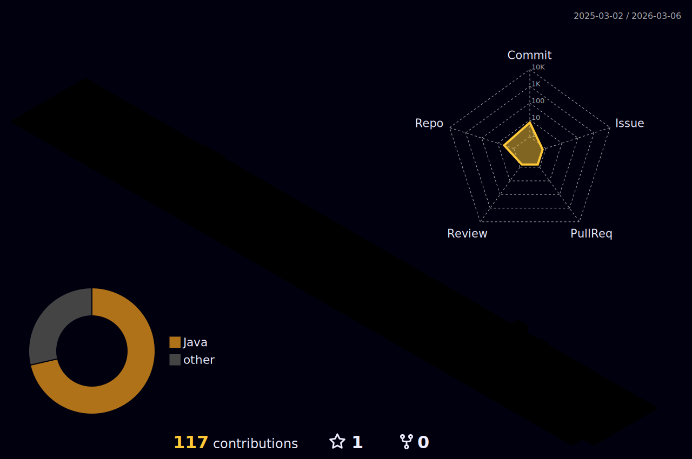

### Hey! 👋

- I'm Érika! 👩🏻‍💻

🌱 - I’m currently learning blockchain

⚡ - Languages: Go, JavaScript nd Solidity

  <a href="https://github.com/erikacls">
  
  

<!--

**erikacls/erikacls** is a ✨ _special_ ✨ repository because its `README.md` (this file) appears on your GitHub profile.

Here are some ideas to get you started:

- 🔭 I’m currently working on ...
- 🌱 I’m currently learning ...
- 👯 I’m looking to collaborate on ...
- 🤔 I’m looking for help with ...
- 💬 Ask me about ...
- 📫 How to reach me: ...
- 😄 Pronouns: ...
- ⚡ Fun fact: ...

  

 

-->

